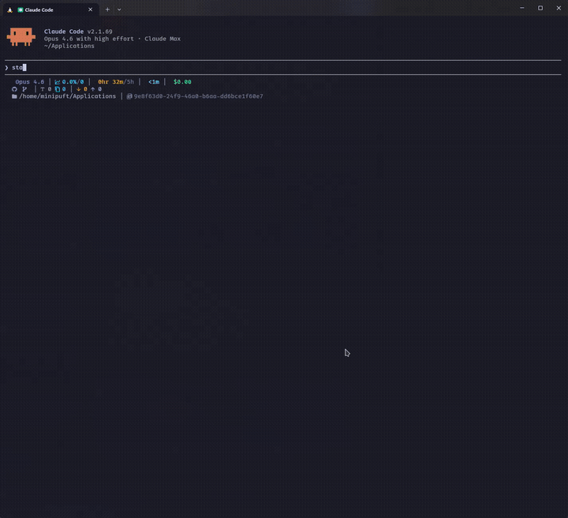
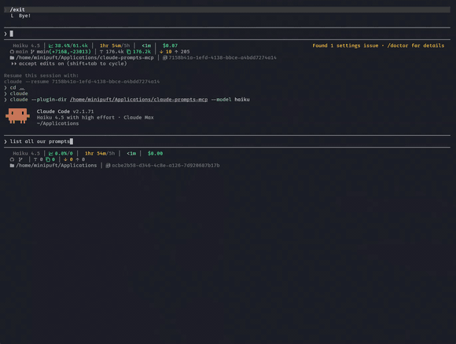
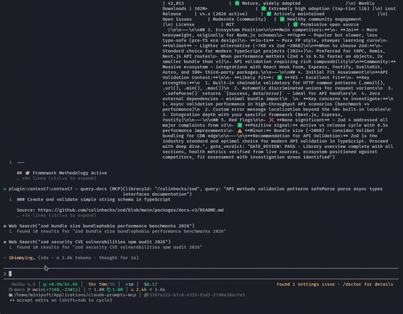
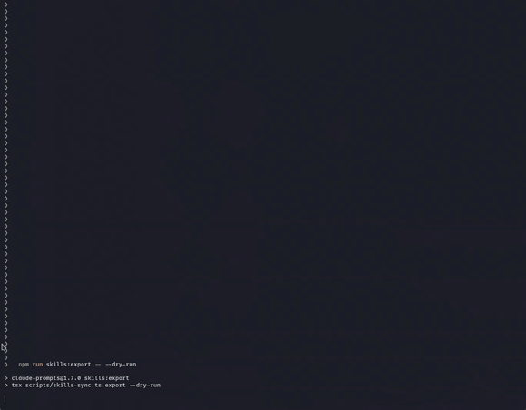
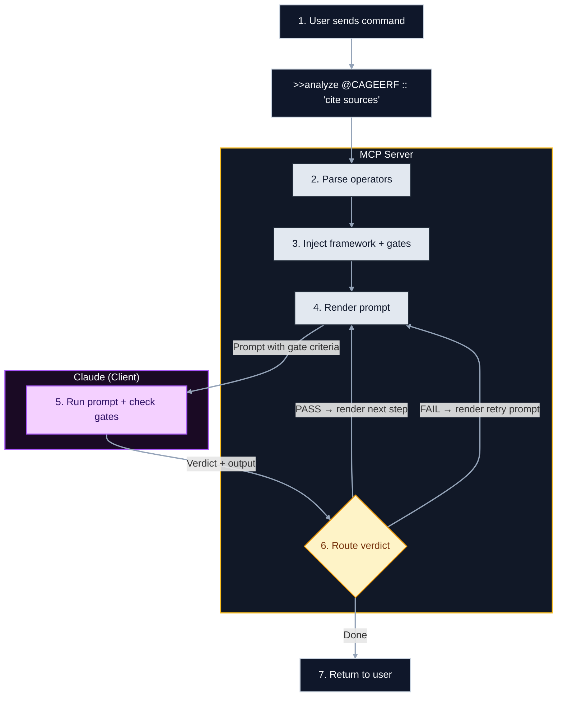

# Claude Prompts MCP Server

<div align="center">


[](https://www.npmjs.com/package/claude-prompts)
[](https://www.gnu.org/licenses/agpl-3.0)

**An MCP workflow server.**

Craft reusable prompts with validation and reasoning guidance.<br>
Orchestrate agentic workflows with a composable operator syntax.<br>
Export as native skills.

[Quick Start](#quick-start) · [What You Get](#what-you-get) · [Compose Workflows](#compose-workflows) · [Run Anywhere](#run-anywhere) · [Docs](#documentation)

</div>

<div align="center">


<sub>Chain + gate validation in action (haiku model) — gates catch errors and guide self-correction, even on the cheapest model</sub>

</div>

### What your AI client gives you — and what this server adds

| Your client already does | This server adds |
|--------------------------|-----------------|
| Run a prompt | Compose prompts with validation, reasoning guidance, and formatting in one expression |
| Single-shot skills | Multi-step workflows that thread context between steps |
| Execute subagents | Hand off mid-chain steps to agents with full workflow context |
| Client-native skill format | Author once as YAML, export to any client with `skills:export` |
| Manual prompt writing | Versioned templates with hot-reload, rollback, and history |
| Trust the output | Validate output between steps — self-evaluation and shell commands |

---

## Quick Start

### Claude Code (Recommended)

```bash
# Add marketplace (first time only)
/plugin marketplace add minipuft/minipuft-plugins

# Install
/plugin install claude-prompts@minipuft

# Try it
>>tech_evaluation_chain library:'zod' context:'API validation'
```

<details>
<summary>Development setup</summary>

Load plugin from local source for development:

```bash
git clone https://github.com/minipuft/claude-prompts ~/Applications/claude-prompts
cd ~/Applications/claude-prompts/server && npm install && npm run build
claude --plugin-dir ~/Applications/claude-prompts
```

Edit hooks/prompts → restart Claude Code. Edit TypeScript → rebuild first.

</details>

**User Data**: Custom prompts stored in `~/.local/share/claude-prompts/` persist across updates.

---

### Claude Desktop

**Option A: GitHub Release** (recommended)

1. Download `claude-prompts-{version}.mcpb` from [Releases](https://github.com/minipuft/claude-prompts/releases/latest)
2. Drag into Claude Desktop Settings → MCP Servers
3. Done

The `.mcpb` bundle is self-contained (~5MB) — no npm required.

**Option B: NPX** (auto-updates)

Add to your config file:
- macOS: `~/Library/Application Support/Claude/claude_desktop_config.json`
- Windows: `%APPDATA%\Claude\claude_desktop_config.json`

```json
{
  "mcpServers": {
    "claude-prompts": {
      "command": "npx",
      "args": ["-y", "claude-prompts@latest", "--client", "claude-code"]
    }
  }
}
```

Restart Claude Desktop and test: `>>research_chain topic:'remote team policies'`

---

<details>
<summary><strong>VS Code / Copilot</strong></summary>

[](https://insiders.vscode.dev/redirect/mcp/install?name=claude-prompts&config=%7B%22command%22%3A%22npx%22%2C%22args%22%3A%5B%22-y%22%2C%22claude-prompts%40latest%22%5D%7D&quality=stable)

Click the badge above for one-click install, or add manually to `.vscode/mcp.json`:

```json
{
  "servers": {
    "claude-prompts": {
      "command": "npx",
      "args": ["-y", "claude-prompts@latest"]
    }
  }
}
```

</details>

<details>
<summary><strong>Cursor</strong></summary>

[](cursor://anysphere.cursor-deeplink/mcp/install?name=claude-prompts&config=eyJjb21tYW5kIjoibnB4IiwiYXJncyI6WyIteSIsImNsYXVkZS1wcm9tcHRzQGxhdGVzdCJdfQ==)

Click the badge above for one-click install, or add manually to `~/.cursor/mcp.json`:

```json
{
  "mcpServers": {
    "claude-prompts": {
      "command": "npx",
      "args": ["-y", "claude-prompts@latest", "--client=cursor"]
    }
  }
}
```

</details>

<details>
<summary><strong>OpenCode</strong></summary>

Install the [opencode-prompts](https://github.com/minipuft/opencode-prompts) plugin — it registers the MCP server **and** adds hooks for chain tracking, gate enforcement, and state preservation:

```bash
npm install -g opencode-prompts
opencode-prompts install
```

> [!NOTE]
> **MCP server only** (no hooks): Add to `~/.config/opencode/opencode.json` with `--client=opencode`. You'll have MCP tools but no chain tracking, gate enforcement, or state preservation across compactions. See [opencode-prompts](https://github.com/minipuft/opencode-prompts) for what hooks provide.

</details>

<details>
<summary><strong>Gemini CLI</strong></summary>

Install the [gemini-prompts](https://github.com/minipuft/gemini-prompts) extension — it registers the MCP server **and** adds hooks for `>>` syntax detection, chain tracking, and gate reminders:

```bash
gemini extensions install https://github.com/minipuft/gemini-prompts
```

> [!NOTE]
> **MCP server only** (no hooks): Run `npx -y claude-prompts@latest --client=gemini` directly. You'll have MCP tools but no `>>` syntax detection, chain tracking, or gate reminders. See [gemini-prompts](https://github.com/minipuft/gemini-prompts) for what hooks provide.

</details>

<details>
<summary><strong>Other Clients</strong> (Codex, Windsurf, Zed)</summary>

Add to your MCP config file with a `--client` preset for deterministic handoff guidance:

| Client | Config Location | Recommended `--client` |
|--------|-----------------|------------------------|
| Codex | `~/.codex/config.toml` | `codex` |
| Windsurf | `~/.codeium/windsurf/mcp_config.json` | `cursor` (experimental) |
| Zed | `~/.config/zed/settings.json` → `mcp` key | `unknown` |

**JSON-based configs (Windsurf/Zed):**
```json
{
  "mcpServers": {
    "claude-prompts": {
      "command": "npx",
      "args": ["-y", "claude-prompts@latest", "--client=cursor"]
    }
  }
}
```

**Codex (`~/.codex/config.toml`):**

```toml
[mcp_servers.claude_prompts]
command = "npx"
args = ["-y", "claude-prompts@latest", "--client=codex"]
```

Supported presets: `claude-code`, `codex`, `gemini`, `opencode`, `cursor`, `unknown`.

For complete per-client setup and limitations:
- [Client Integration Guide](docs/guides/client-integration.md)
- [Client Capabilities Reference](docs/reference/client-capabilities.md)

</details>

<details>
<summary><strong>From Source</strong> (developers only)</summary>

```bash
git clone https://github.com/minipuft/claude-prompts.git
cd claude-prompts/server
npm install && npm run build && npm test
```

Point your MCP config to `server/dist/index.js`. The esbuild bundle is self-contained.

**Transport options**: `--transport=stdio` (default), `--transport=streamable-http` (HTTP clients).

</details>

### Custom Resources

Use your own prompts without cloning. Add `MCP_RESOURCES_PATH` to any MCP config:

```json
{
  "mcpServers": {
    "claude-prompts": {
      "command": "npx",
      "args": ["-y", "claude-prompts@latest", "--client", "claude-code"],
      "env": {
        "MCP_RESOURCES_PATH": "/path/to/your/resources"
      }
    }
  }
}
```

Your resources directory can contain: `prompts/`, `gates/`, `methodologies/`, `styles/`.

See [CLI Configuration](docs/reference/mcp-tools.md#cli-configuration) for all options including fine-grained path overrides.

---

<details>
<summary><strong>See the dashboard</strong> — system status overview</summary>

<br>



<sub>Loaded resources, active configuration, and server health at a glance</sub>

</details>

---

## What You Get

Four resource types you author, version, and compose into workflows.

<details>
<summary><strong>See the catalog</strong> — listing all available prompts</summary>

<br>



<sub>90 prompts across 11 categories — all hot-reloadable and versionable</sub>

</details>

### Prompt Templates

Versioned YAML with hot-reload. Edit a template, test it immediately — or ask your AI to update it through MCP.

```
>>code_review target:'src/auth/' language:'typescript'
```

### Validation Rules (Gates)

Criteria the AI checks its own output against. Blocking or advisory.

```
:: 'no false positives' :: 'cite sources with links'
```

Failed checks can retry automatically or pause for your decision.

### [Reasoning Guidance (Methodologies)](docs/guides/methodologies.md)

Frameworks that shape how the AI thinks through a problem — not just what it outputs. 6 built-in, or create your own.

```
@CAGEERF    # Context → Analysis → Goals → Execution → Evaluation → Refinement
@ReACT      # Reason → Act → Observe loops
@5W1H       # Who, What, Where, When, Why, How
```

### Styles

Response formatting and tone.

```
#analytical    # Structured, evidence-based output
#concise       # Brief, action-focused
```

All resources are hot-reloadable, versioned with rollback history, and managed through the `resource_manager` tool.

> [!TIP]
> **Ready to build your own?** Start with the [Prompt Authoring Tutorial](docs/tutorials/build-first-prompt.md).

---

## Compose Workflows

The operator syntax wires resources together — chain steps, add validation inline, hand off steps to agents.

```
>>review target:'src/auth/' @CAGEERF :: 'no false positives'
  --> security_scan :: verify:"npm test"
  --> recommendations :: 'actionable, with code'
  ==> implementation
```

<details>
<summary><strong>See the chain</strong> — phases completing back-to-back</summary>

<br>


<sub>Phases compound reasoning across steps — each step builds on validated output from the previous one</sub>

</details>

<details>
<summary><strong>See the output</strong> — tech evaluation chain with context7 research</summary>

<br>



<sub>Context7 fetches live library docs mid-chain — final output is a structured assessment with sources</sub>

</details>

What happened:
1. Loaded the `review` template with arguments
2. Injected CAGEERF reasoning guidance
3. Added a validation rule (AI self-evaluates against it)
4. Chained output to the next step
5. Ran a shell command for ground-truth validation
6. Handed the final step off to a client-native subagent

### Verification Loops

Ground-truth validation via shell commands — the AI keeps iterating until tests pass:

```
>>implement-feature :: verify:"npm test" loop:true
```

Implements, runs the test, reads failures, fixes, retries. Spawns a fresh context after repeated failures to avoid context rot.

| Preset | Tries | Timeout | Use Case |
|--------|-------|---------|----------|
| `:fast` | 1 | 30s | Quick check |
| `:full` | 5 | 5 min | CI validation |
| `:extended` | 10 | 10 min | Large test suites |

### Judge Mode

Let the AI pick the right resources for the task:

```
%judge Help me refactor this authentication module
```

Analyzes available templates, reasoning frameworks, validation rules, and styles — applies the best combination automatically.

> [!TIP]
> Chains support conditional branching, context threading, and agent handoffs.
> [Chains Lifecycle](docs/concepts/chains-lifecycle.md) · [MCP Tools Reference](docs/reference/mcp-tools.md)

---

## Run Anywhere

Author workflows as YAML templates. Export as native skills to your client.

```yaml
# skills-sync.yaml — choose what to export
registrations:
  claude-code:
    user:
      - prompt:development/review
      - prompt:development/validate_work
```

```bash
npm run skills:export
```

The `review` prompt becomes a `/review` Claude Code skill. `validate_work` becomes `/validate_work`. Same source, native experience — no MCP call required at runtime.

Compiles to Claude Code skills, Cursor rules, OpenCode commands, and more. `npm run skills:diff` flags when exports drift from source.

<details>
<summary><strong>See the export</strong> — dry-run compile + skill preview</summary>

<br>



<sub>Dry-run compiles YAML templates into native client skills — review before writing</sub>

</details>

> [!TIP]
> The [Skills Sync Guide](docs/guides/skills-sync.md) covers configuration, supported clients, and drift detection.

---

### With Hooks

Well-composed prompts carry their own structure. Hooks keep the experience consistent across models and long sessions.

<details>
<summary>What hooks do</summary>

Route operator syntax to the right tool automatically.
Track workflow progress across steps and long sessions.
Enforce validation rules and step handoffs between agents.

| Behavior | What happens |
|----------|-------------|
| Prompt routing | `>>analyze` in conversation → correct MCP tool call |
| Chain continuity | Injects step progress and continuation between steps |
| Validation tracking | Tracks pass/fail verdicts across chain steps |
| Agent handoffs | Routes `==>` steps to client-native subagents |
| Session persistence | Preserves workflow state through context compaction |

Hooks ship with the plugin install. Available for [Claude Code](.) (full), [OpenCode](https://github.com/minipuft/opencode-prompts) (full), [Gemini CLI](https://github.com/minipuft/gemini-prompts) (partial). Other clients: MCP tools only.

→ [hooks/README.md](hooks/README.md)

</details>

---

<details>
<summary><strong>Syntax Reference</strong></summary>

| Symbol | Name | What It Does | Example |
|:------:|:-----|:-------------|:--------|
| `>>` | Prompt | Execute template | `>>code_review` |
| `-->` | Chain | Pipe to next step | `step1 --> step2` |
| `==>` | Handoff | Route step to agent | `step1 ==> agent_step` |
| `*` | Repeat | Run prompt N times | `>>brainstorm * 5` |
| `@` | Framework | Inject reasoning guidance | `@CAGEERF` |
| `::` | Gate | Add validation criteria | `:: 'cite sources'` |
| `%` | Modifier | Toggle behavior | `%clean`, `%judge` |
| `#` | Style | Apply formatting | `#analytical` |

**Modifiers:**
- `%clean` — No framework/gate injection
- `%lean` — Gates only, skip framework
- `%guided` — Force framework injection
- `%judge` — AI selects best resources

→ [MCP Tools Reference](docs/reference/mcp-tools.md) for full command documentation.

</details>

<details>
<summary><strong>The Three Tools</strong></summary>

| Tool | Purpose |
|------|---------|
| `prompt_engine` | Execute prompts with frameworks and validation |
| `resource_manager` | Create, update, version, and export resources |
| `system_control` | Status, analytics, framework switching |

```
prompt_engine(command:"@CAGEERF >>analysis topic:'AI safety'")
resource_manager(resource_type:"prompt", action:"list")
system_control(action:"status")
```

</details>

---

## How It Works



Command with operators → server parses and injects resources → client executes and self-evaluates → route: next step (pass), retry (fail), or return result (done).

---

## Documentation

| I want to... | Go here |
|-------------|---------|
| Build my first prompt | [Prompt Authoring Tutorial](docs/tutorials/build-first-prompt.md) |
| Chain multi-step workflows | [Chains Lifecycle](docs/concepts/chains-lifecycle.md) |
| Add validation to workflows | [Gates Guide](docs/guides/gates.md) |
| Use or create reasoning frameworks | [Methodologies Guide](docs/guides/methodologies.md) |
| Use autonomous verification loops | [Ralph Loops](docs/guides/ralph-loops.md) |
| Configure per-client MCP installs and `--client` presets | [Client Integration Guide](docs/guides/client-integration.md) |
| Compare client profile mapping and limitations | [Client Capabilities Reference](docs/reference/client-capabilities.md) |
| Export skills to other clients | [Skills Sync](docs/guides/skills-sync.md) |
| Configure the server | [CLI & Configuration](docs/guides/cli.md) |
| Look up MCP tool parameters | [MCP Tools Reference](docs/reference/mcp-tools.md) |
| Understand the architecture | [Architecture Overview](docs/architecture/overview.md) |

---

## Contributing

```bash
cd server
npm install
npm run build        # esbuild bundles to dist/index.js
npm test             # Run test suite
npm run validate:all # Full CI validation
```

The build produces a self-contained bundle. `server/dist/` is gitignored — CI builds fresh from source.

See [CONTRIBUTING.md](CONTRIBUTING.md) for workflow details.

---

## License

[AGPL-3.0](LICENSE)
