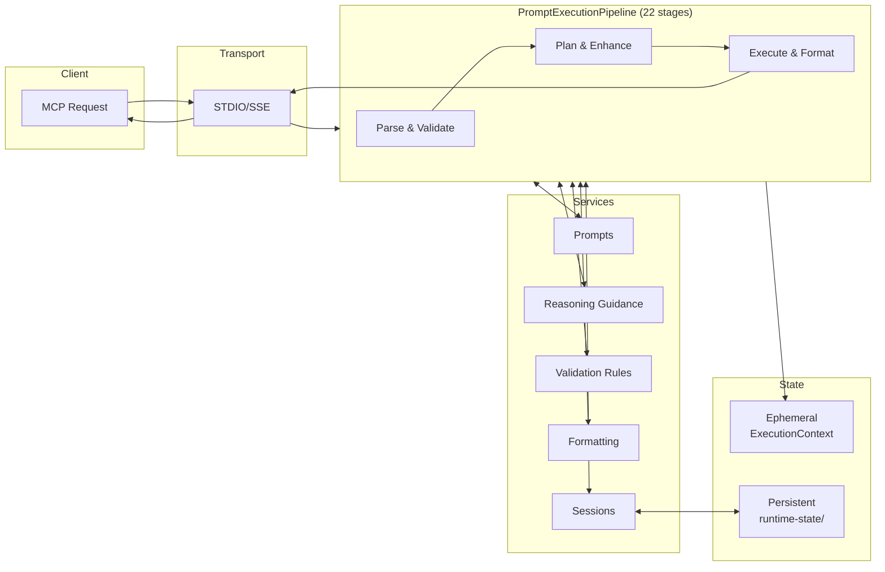
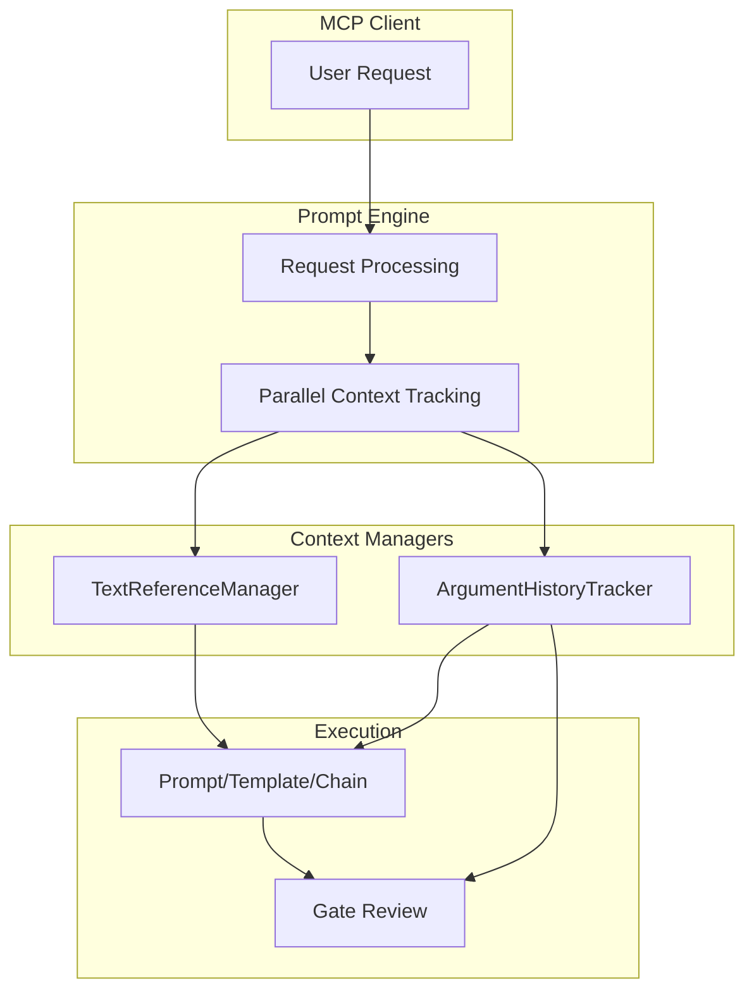

# Architecture Guide


How a prompt goes from what you type to a structured, validated response — and where each piece plugs in.

**Read this when** you want to understand the system internals: how requests flow, where validation and reasoning guidance get injected, and which files to look at when debugging or extending.

**You'll learn**

- How a request flows: Client → Transport → Pipeline → Response
- Where validation rules (gates), reasoning guidance (methodologies), and formatting (styles) get applied
- Which files to inspect when debugging or extending

**Prerequisites**: Server running (see [README Quick Start](../README.md#quick-start)).

---

## System Overview

The server receives commands through three MCP tools, processes them through a multi-stage pipeline that injects validation and reasoning guidance, and returns structured responses to the client.

### Request Lifecycle

This is how a `prompt_engine` request actually flows through the system:



### How Requests Flow Through the System

```
┌─────────────────────────────────────────────────────────────────┐
│                        MCP Protocol Layer                        │
│  ┌─────────────┐  ┌──────────────┐  ┌─────────────┐             │
│  │prompt_engine│  │resource_manager│ │system_control│            │
│  └──────┬──────┘  └───────┬──────┘  └──────┬──────┘             │
├─────────┼─────────────────┼────────────────┼────────────────────┤
│         │                 │                │   Routing Layer     │
│         │          ┌──────┴──────┐         │                     │
│         │          │   Router    │         │                     │
│         │          └──────┬──────┘         │                     │
│         │     ┌───────────┼───────────┐    │                     │
│         │     ▼           ▼           ▼    │                     │
│         │ ┌───────┐ ┌─────────┐ ┌─────────┐│                     │
│         │ │Prompt │ │  Gate   │ │Framework││                     │
│         │ │Manager│ │ Manager │ │ Manager ││                     │
│         │ └───────┘ └─────────┘ └─────────┘│                     │
├─────────┼─────────────────────────────────┼────────────────────┤
│         │                                  │   Execution Layer   │
│         ▼                                  │                     │
│  ┌──────────────────┐                      │                     │
│  │PromptExecution   │                      │                     │
│  │Pipeline (23 stg) │                      │                     │
│  └────────┬─────────┘                      │                     │
├───────────┼────────────────────────────────┼────────────────────┤
│           │                                │   Service Layer     │
│     ┌─────┴─────┬──────────┬───────────┬───┴───────┐            │
│     ▼           ▼          ▼           ▼           ▼            │
│ ┌───────┐  ┌─────────┐  ┌───────┐  ┌───────┐  ┌─────────┐      │
│ │Prompts│  │Frameworks│  │ Gates │  │Styles │  │Sessions │      │
│ │Registry│ │ Manager │  │Manager│  │Manager│  │ Manager │      │
│ └───┬───┘  └────┬────┘  └───┬───┘  └───┬───┘  └────┬────┘      │
├─────┼───────────┼───────────┼──────────┼───────────┼────────────┤
│     │           │           │          │           │  Persistence│
│     ▼           ▼           ▼          ▼           ▼             │
│ prompts/    methodologies/  gates/    styles/    runtime-state/  │
│ *.md,json   */method.yaml  */gate.yaml */style.yaml  state.db    │
│             */phases.yaml  */guidance  */guidance   (SQLite)     │
└─────────────────────────────────────────────────────────────────┘
```

### What Each Layer Does

| Layer            | Components                    | Responsibility                                             |
| ---------------- | ----------------------------- | ---------------------------------------------------------- |
| **MCP Protocol** | 3 registered tools            | Receive MCP requests, validate schemas, return responses   |
| **Routing**      | resource_manager router       | Routes CRUD operations to specialized managers             |
| **Execution**    | Pipeline + 22 stages          | Transform request → parse → enhance → execute → format     |
| **Service**      | Managers + registries         | Business logic for prompts, frameworks, gates, styles, sessions |
| **Persistence**  | File system + SQLite           | Hot-reload sources (YAML/MD), runtime state (SQLite)       |

### Why The Pipeline Matters

The `PromptExecutionPipeline` is the architectural centerpiece. Every `prompt_engine` call:

1. Creates fresh `ExecutionContext` (ephemeral state)
2. Flows through up to 22 stages sequentially
3. Each stage reads/writes to context
4. Services are called as needed by stages
5. Response assembled at the end

This design means:

- **Predictable**: Same stages, same order, every time
- **Debuggable**: Each stage logs entry/exit with timing and memory metrics
- **Extensible**: Add a stage file, register it, done

### Key Design Decisions

| Decision                     | Rationale                                                |
| ---------------------------- | -------------------------------------------------------- |
| **3-Tool Architecture**      | Token economy: fewer tools = less context overhead       |
| **resource_manager Routing** | Single entry point fans out to specialized managers      |
| **SQLite State**             | WAL mode for concurrent access, single state.db file     |
| **Optional Frameworks**      | Disabled by default for performance                      |
| **Hot Reload**               | Prompt/gate/style changes without server restart         |
| **Pipeline-First**           | Every request flows through the same staged pipeline     |
| **Contracts as SSOT**        | Tool descriptions and Zod schemas generated from JSON contracts |

---

## Quick Start for Developers

### Codebase Map

```
server/src/
├── runtime/                    # Application lifecycle
│   └── application.ts          # 4-phase startup orchestrator
├── server/transport/           # STDIO + SSE protocol handlers
├── mcp-tools/                  # MCP tool layer
│   ├── index.ts                # Registers 3 MCP tools
│   ├── prompt-engine/          # → PromptExecutionPipeline
│   │   └── core/               # PromptExecutor + PipelineBuilder + PipelineDependencies
│   ├── resource-manager/       # Unified router
│   │   └── prompt/             # Prompt CRUD (handler → lifecycle/discovery/versioning)
│   ├── gate-manager/           # Gate CRUD
│   │   ├── core/               # Thin handler + context
│   │   └── services/           # GateLifecycleProcessor, GateDiscoveryProcessor, GateVersioningProcessor
│   ├── framework-manager/      # Framework CRUD
│   │   ├── core/               # Thin handler + context
│   │   └── services/           # FrameworkLifecycleProcessor, FrameworkDiscoveryProcessor, etc.
│   └── system-control/         # System administration
│       ├── core/               # Router + action handler base + types
│       └── handlers/           # 10 action handlers (status, framework, gate, session, etc.)
├── execution/                  # Execution layer
│   ├── pipeline/stages/        # 24 stage files (thin orchestrators)
│   ├── pipeline/state/         # Accumulators (gates, diagnostics)
│   ├── pipeline/decisions/     # Decision services (injection, gates)
│   ├── parsers/                # Command parsing + blueprint resolution
│   ├── capture/                # Step capture service
│   ├── formatting/             # Response assembly + context types
│   ├── context/                # ExecutionContext + type guards
│   ├── planning/               # Execution planner
│   └── reference/              # Reference resolution
├── prompts/                    # Prompt registry + hot-reload
├── frameworks/                 # Methodology system
│   ├── methodology/            # YAML loaders, validation
│   └── framework-manager.ts    # Stateless orchestrator
├── gates/                      # Quality validation
│   ├── core/                   # GateLoader, validators
│   ├── registry/               # GateRegistry, GenericGateGuide
│   ├── hot-reload/             # GateHotReloadCoordinator
│   ├── judge/                  # Judge resource collection + menu formatting
│   └── services/               # Gate resolution, enhancement, verdict processing
├── styles/                     # Response formatting
│   ├── core/                   # StyleDefinitionLoader, schema
│   ├── hot-reload/             # StyleHotReloadCoordinator
│   └── style-manager.ts        # Style orchestration
├── scripts/                    # Script tool system
│   ├── detection/              # Tool detection service
│   ├── execution/              # Script executor
│   └── core/                   # Definition loader
├── chain-session/              # Multi-step workflow state (SQLite-backed)
├── text-references/            # ArgumentHistoryTracker (SQLite-backed)
├── tracking/                   # Resource change audit logging
├── database/                   # SqliteEngine + SqliteStateStore
├── mcp-contracts/schemas/      # Generated Zod schemas
└── action-metadata/            # Action definitions and telemetry
server/resources/               # Hot-reloaded resource definitions
├── methodologies/              # Methodology definitions
│   └── {methodology-id}/
│       ├── methodology.yaml    # Configuration
│       ├── phases.yaml         # Phase definitions
│       └── system-prompt.md    # Injected guidance
├── gates/                      # Gate definitions
│   └── {gate-id}/
│       ├── gate.yaml           # Configuration
│       └── guidance.md         # Guidance content (inlined at load)
└── styles/                     # Style definitions
    └── {style-id}/
        ├── style.yaml          # Configuration
        └── guidance.md         # Guidance content (inlined at load)
```

### Common Tasks

| Task                  | Where to Look                                                          |
| --------------------- | ---------------------------------------------------------------------- |
| Add new prompt        | `server/prompts/[category]/` - create `.md` + update `prompts.json`    |
| Modify pipeline stage | `server/src/execution/pipeline/stages/`                                |
| Add methodology       | `server/resources/methodologies/{id}/` - create YAML + MD files        |
| Add/modify gate       | `server/resources/gates/{id}/` - create `gate.yaml` + `guidance.md`    |
| Add/modify style      | `server/resources/styles/{id}/` - create `style.yaml` + `guidance.md`  |
| Debug session issues  | `server/src/chain-session/` + `runtime-state/state.db`              |
| Update configuration  | `server/config.json`                                                |
| Modify tool schemas   | `server/tooling/contracts/*.json` then `npm run generate:contracts` |

### Entry Points

| File                                                  | Purpose                     |
| ----------------------------------------------------- | --------------------------- |
| `src/index.ts`                                        | Server startup              |
| `src/mcp-tools/index.ts`                              | Tool registration           |
| `src/mcp-tools/prompt-engine/core/prompt-executor.ts` | Prompt engine orchestration |
| `src/mcp-tools/prompt-engine/core/pipeline-builder.ts`| Pipeline construction (22 stages) |
| `src/execution/pipeline/prompt-execution-pipeline.ts` | Pipeline stage execution    |
| `src/mcp-tools/system-control/core/system-control.ts` | System control routing      |
| `src/prompts/registry.ts`                             | Prompt management           |
| `src/frameworks/framework-manager.ts`                 | Framework logic             |
| `src/gates/gate-manager.ts`                           | Gate orchestration          |
| `src/gates/registry/gate-registry.ts`                 | Gate lifecycle management   |
| `src/styles/style-manager.ts`                         | Style orchestration         |
| `src/tracking/resource-change-tracker.ts`             | Change audit logging        |
| `src/database/sqlite-engine.ts`                       | SQLite persistence layer    |

---

## Execution Pipeline

Every `prompt_engine` call flows through up to 22 stages. Stage files are numbered for organization, but **execution order is determined by the pipeline orchestrator**, not file names.

### Stage Execution Order

The pipeline registers stages in this order (from `prompt-execution-pipeline.ts`):

```
┌─────────────────────────────────────────────────────────────────────┐
│                        INITIALIZE & PARSE                           │
├─────────────────────────────────────────────────────────────────────┤
│ 1. RequestNormalization      Consolidate deprecated params → `gates`│
│ 2. DependencyInjection       Inject framework manager, services     │
│ 3. ExecutionLifecycle        Initialize execution tracking          │
│ 4. CommandParsing            Parse command, extract arguments       │
│ 5. InlineGate                Register `::` criteria as temp gates   │
│ 6. OperatorValidation        Validate `@framework` overrides        │
├─────────────────────────────────────────────────────────────────────┤
│                        PLAN & ENHANCE                               │
├─────────────────────────────────────────────────────────────────────┤
│ 7. ExecutionPlanning         Determine strategy, gates, session     │
│ 8. ScriptExecution*          Run matched script tools               │
│ 9. ScriptAutoExecute*        Call MCP tools from script output      │
│10. JudgeSelection            Select evaluation criteria (%judge)    │
│11. GateEnhancement           Process gates, render guidance         │
│12. FrameworkResolution       Resolve active framework               │
│13. SessionManagement         Chain/session lifecycle                │
│14. InjectionControl          Control framework injection per-step   │
│15. PromptGuidance            Inject methodology guidance            │
├─────────────────────────────────────────────────────────────────────┤
│                        EXECUTE & FORMAT                             │
├─────────────────────────────────────────────────────────────────────┤
│16. ResponseCapture           Capture previous step results          │
│17. ShellVerification*        Run shell commands to validate work    │
│18. StepExecution             Execute prompts with Nunjucks          │
│19. AssertionVerification*    Check methodology phase assertions     │
│20. GateReview                Validate gate verdicts (PASS/FAIL)     │
│21. ResponseFormatting        Assemble response + usage CTA          │
│22. PostFormattingCleanup     Clean up temporary state               │
└─────────────────────────────────────────────────────────────────────┘

* Stages 8-9 (Script), 17 (ShellVerification), 19 (AssertionVerification) are optional
```

### Pipeline Behavior

| Behavior         | Description                                                   |
| ---------------- | ------------------------------------------------------------- |
| **Sequential**   | Stages execute in order, no skipping                          |
| **Early exit**   | Pipeline stops when `context.response` is set                 |
| **Stage no-ops** | Stages may skip based on context (e.g., frameworks disabled)  |
| **Metrics**      | Each stage reports timing and memory delta                    |
| **Recovery**     | Errors in a stage are caught, logged, and can trigger cleanup |

### Script Tool Pipeline

Stages 8 and 9 enable prompts to include validation scripts that auto-trigger based on user input.

```
User Input → ScriptExecution → ScriptAutoExecute → Template Context
                     │                  │
                     ▼                  ▼
            Schema match?          Script returned
            Run script             {valid: true, auto_execute}?
                                   Call MCP tool
```

| Stage | Trigger | Output |
|-------|---------|--------|
| **ScriptExecution** | User args match tool's `schema.json` | Script result → `{{tool_<id>}}` |
| **ScriptAutoExecute** | Script returns `auto_execute` block | MCP tool response → `{{tool_<id>_result}}` |

**Use case**: Meta-prompts like `>>create_gate` that validate input and auto-create resources.

See [Script Tools Guide](../guides/script-tools.md) for building script-enabled prompts.

---

## MCP Tool Architecture

### External vs Internal Tools

The server exposes **3 MCP tools** to clients but internally uses **5 specialized managers**:

```
┌─────────────────────────────────────────────────────────────┐
│                    MCP Protocol (3 tools)                    │
│  ┌─────────────┐  ┌──────────────┐  ┌──────────────┐        │
│  │prompt_engine│  │resource_manager│ │system_control│       │
│  └──────┬──────┘  └───────┬──────┘  └───────┬──────┘        │
└─────────┼─────────────────┼─────────────────┼───────────────┘
          │                 │                 │
          ▼                 ▼                 ▼
┌─────────────────────────────────────────────────────────────┐
│                    Internal Managers                         │
│                                                              │
│  prompt_engine ──► PromptExecutor ──► PipelineBuilder       │
│                                        └► PromptExecution   │
│                                           Pipeline (23 stg) │
│                                                              │
│  resource_manager ──► Router ──┬► PromptResourceHandler     │
│                                │   └► lifecycle/discovery/  │
│                                │      versioning processors │
│                                ├► GateToolHandler           │
│                                │   └► lifecycle/discovery/  │
│                                │      versioning processors │
│                                └► FrameworkToolHandler       │
│                                    └► lifecycle/discovery/  │
│                                       versioning/validation │
│                                                              │
│  system_control ──► SystemControl Router                    │
│                      └► 10 action handlers                  │
│                         (status, framework, gate, session,  │
│                          guide, analytics, config, etc.)    │
└─────────────────────────────────────────────────────────────┘
```

### Tool Responsibilities

| Tool | Purpose | Internal Target |
|------|---------|-----------------|
| `prompt_engine` | Execute prompts and chains | PromptExecutor → PipelineBuilder → PromptExecutionPipeline |
| `resource_manager` | CRUD for prompts, gates, methodologies | Router → Handler → Processors (lifecycle/discovery/versioning per resource type) |
| `system_control` | System status, framework switching, analytics | SystemControl router → 10 specialized action handlers |

### Why This Design?

1. **Token Economy**: 3 tools consume less context than 5+ tools
2. **Intent Clarity**: LLMs route better through a unified CRUD interface
3. **Separation of Concerns**: Internal managers can evolve independently
4. **Contract Stability**: External API (3 tools) stays stable while internal structure can change

### MCP Resources (Read-Only Discovery)

In addition to tools, the server exposes **MCP Resources** for token-efficient read-only access:

```
┌──────────────────────────────────────────────────────────────────────────────┐
│                          MCP Resources Protocol                               │
│  resources/list  ←───────────────────────────────────────────────────────────┤
│  resources/read   ───────────────────────────────────────────────────────────┤
└──────────────────────────────────────────────────────────────────────────────┘
     │              │              │              │              │
     ▼              ▼              ▼              ▼              ▼
┌──────────┐  ┌──────────┐  ┌──────────┐  ┌──────────┐  ┌──────────┐
│ Prompts  │  │  Gates   │  │Methodol- │  │ Sessions │  │ Metrics  │
│ prompt/  │  │  gate/   │  │  ogies   │  │ session/ │  │ metrics/ │
│ prompt/  │  │  gate/   │  │methodol- │  │ session/ │  │ pipeline │
│   {id}   │  │   {id}   │  │  ogy/    │  │{chainId} │  │          │
└──────────┘  └──────────┘  └──────────┘  └──────────┘  └──────────┘
     │              │              │              │              │
     ▼              ▼              ▼              ▼              ▼
┌──────────┐  ┌──────────┐  ┌──────────┐  ┌──────────┐  ┌──────────┐
│ Prompt   │  │  Gate    │  │Framework │  │  Chain   │  │ Metrics  │
│ Manager  │  │ Manager  │  │ Manager  │  │ Session  │  │Collector │
│          │  │          │  │          │  │ Manager  │  │          │
└──────────┘  └──────────┘  └──────────┘  └──────────┘  └──────────┘
```

**Resource Categories**:

| Category | Resources | Purpose |
|----------|-----------|---------|
| Content | `prompt/`, `gate/`, `methodology/` | Discover and inspect templates/configs |
| Observability | `session/`, `metrics/pipeline` | Monitor active chains and system health |

**Token Efficiency**: Resources are 4-30x more efficient than tool-based operations. Metrics reduced from ~15KB (raw samples) to ~500 bytes (lean aggregates).

**Context Recovery**: Session resources use `chainId` (e.g., `chain-quick_decision#1`) — the same identifier used to resume chains. No lookup required.

**Hot-Reload Compatibility**: Resources read from singleton registries at request time. When hot-reload updates a registry, resources immediately reflect the change. Connected clients receive `notifications/resources/list_changed` to trigger cache refresh.

See [MCP Resources documentation](../reference/mcp-tools.md#mcp-resources--token-efficient-discovery) for URI patterns and usage.

---

## Pipeline State Management

Three centralized components prevent bugs from distributed state:

### State Components

| Component                    | Purpose                                          | Access                       |
| ---------------------------- | ------------------------------------------------ | ---------------------------- |
| `GateAccumulator`            | Collects gates with priority-based deduplication | `context.gates`              |
| `DiagnosticAccumulator`      | Collects warnings/errors from stages             | `context.diagnostics`        |
| `FrameworkDecisionAuthority` | Single source for framework decisions            | `context.frameworkAuthority` |

### GateAccumulator

Prevents duplicate gates by tracking source priority:

```typescript
// Priority order (higher wins):
// inline-operator (100) > client-selection (90) > temporary-request (80) >
// prompt-config (60) > chain-level (50) > methodology (40) > registry-auto (20)

context.gates.add("research-quality", "registry-auto");
context.gates.addAll(methodologyGates, "methodology");
const finalGates = context.gates.getAll(); // Deduplicated
```

### FrameworkDecisionAuthority

Resolves framework from multiple sources:

```typescript
// Priority: modifiers (%clean/%lean) > @ operator > client > global
const decision = context.frameworkAuthority.decide({
  modifiers: context.executionPlan?.modifiers,
  operatorOverride: context.parsedCommand?.frameworkOverride,
  clientOverride: context.state.framework.clientOverride,
  globalActiveFramework: "CAGEERF",
});
if (decision.shouldApply) {
  // Use decision.frameworkId
}
```

### DiagnosticAccumulator

Creates audit trail across stages:

```typescript
context.diagnostics.info(this.name, "Gate enhancement complete", {
  gateCount: context.gates.size,
  sources: context.gates.getSourceCounts(),
});
```

### Assertion–Gate Review Composition

Assertions (structural, deterministic) and LLM quality gates (subjective) check orthogonal dimensions. When both are active, their results compose rather than compete:

| Gate Type | Stage | Checks | Nature |
|-----------|-------|--------|--------|
| Assertion gates (`__assertion_structural__`) | 09b | Structure — are required sections present, minimum length met? | Deterministic |
| Shell verification (`:: verify:`) | 08b | Command output — does shell command pass? | Deterministic |
| LLM quality gates | 08 | Content quality — depth of analysis, actionability? | Subjective |

**Composition contract**: When Stage 09b assertions pass and a pending LLM gate review exists, the assertion results are **merged into** the gate review prompt as pre-validated structural context. The LLM reviewer sees "Structure: PASS (N/N phases)" and focuses on content quality. The gate review is retained — not cleared.

**Assertion failures**: When assertions fail, they create their own `PendingGateReview` with feedback. No merge occurs — the review IS the assertion feedback.

**Double-injection guard**: `metadata.assertionContext` is checked before injecting. If already present (e.g., retry cycle), the summary is not prepended again.

**Authority model**: `sessionContext.pendingReview` is a fast-path signal (present = render review screen). Stage 10 always re-fetches from `chainSessionManager.getPendingGateReview()` before rendering, making the manager the authoritative source.

**Escalation source tracking**: When retry limits are exceeded, `context.state.gates.escalationSource` indicates whether the escalation originated from `'gate-review'` (Stage 08) or `'shell-verify'` (Stage 08b). Both stages write to the shared `retryLimitExceeded` / `awaitingUserChoice` flags sequentially.

---

## Pipeline Domain Services

Pipeline stages are thin orchestrators (~60-210 lines). Domain logic lives in services owned by their respective domains, injected via stage constructors.

### Gate Domain (`engine/gates/`)

| Service | Location | Purpose | Stage |
|---------|----------|---------|-------|
| `GateEnhancementService` | `gates/services/` | Gate selection, methodology coordination, prompt enhancement | 05 GateEnhancement |
| `TemporaryGateRegistrar` | `gates/services/` | Inline/temp gate normalization and registration | 05 GateEnhancement |
| `GateMetricsRecorder` | `gates/services/` | Gate usage analytics | 05 GateEnhancement |
| `GateVerdictProcessor` | `gates/services/` | Verdict parsing, gate action handling, deferred verdicts | 08 ResponseCapture |
| `InlineGateProcessor` | `gates/services/` | `::` criteria parsing, shell-verify extraction, temp gate creation | 02 InlineGate |
| `GateShellVerifyRunner` | `gates/services/` | Shell command execution for `:: verify:` gates | 08b ShellVerification |
| `JudgeResourceCollector` | `gates/judge/` | Collect styles/frameworks/gates for judge selection | 06a JudgeSelection |
| `JudgeMenuFormatter` | `gates/judge/` | Format resource menus for two-phase judge flow | 06a JudgeSelection |

### Execution Domain (`engine/execution/`)

| Service | Location | Purpose | Stage |
|---------|----------|---------|-------|
| `ChainBlueprintResolver` | `execution/parsers/` | Restore chain session blueprints for response-only mode | 01 CommandParsing |
| `SymbolicCommandBuilder` | `execution/parsers/` | Build ParsedCommand from symbolic operator parse results | 01 CommandParsing |
| `StepCaptureService` | `execution/capture/` | Step result capture, placeholder generation | 08 ResponseCapture |
| `ResponseAssembler` | `execution/formatting/` | Response formatting, chain footer building, usage CTA, gate validation info | 10 ResponseFormatting |
| `ChainOperatorExecutor` | `execution/operators/` | Chain step rendering, delegation CTA building | 09 StepExecution |

### See Also

- [Gate System Guide](../guides/gates.md) — gate definitions, activation rules, enforcement
- [Injection Control](../guides/injection-control.md) — how framework/gate/style guidance is injected per step
- [Stage Execution Order](#stage-execution-order) — full pipeline stage listing with descriptions

---

## Ephemeral vs Persistent State

Understanding which state survives across MCP requests is critical for cross-request features.

### State Lifecycle

| Category               | Lifecycle                        | Storage                | Access                       |
| ---------------------- | -------------------------------- | ---------------------- | ---------------------------- |
| **Ephemeral**          | Dies after each request          | `ExecutionContext`     | `context.state.*`            |
| **Session-Persistent** | Survives across session requests | `ChainSessionManager`  | `chainSessionManager.get*()` |
| **Global-Persistent**  | Survives server restarts         | `runtime-state/*.json` | State managers               |

### Ephemeral State (Per-Request)

Recreated fresh for every MCP tool call:

```typescript
// WRONG: Lost after response
context.state.gates.retryLimitExceeded = true;

// Request 2: Always undefined!
if (context.state.gates.retryLimitExceeded) {
  /* Never runs */
}
```

### Session-Persistent State

Survives across requests for the same session:

```typescript
// CORRECT: Persists to SQLite chain_sessions table
await chainSessionManager.setPendingGateReview(sessionId, review);

// Next request: Works!
const review = chainSessionManager.getPendingGateReview(sessionId);
```

### Global-Persistent State

Survives server restarts. All state persisted in `runtime-state/state.db` (SQLite via `node:sqlite`).

| State               | Store                    | SQLite Table              |
| ------------------- | ------------------------ | ------------------------- |
| Framework selection | `FrameworkStateStore`    | `framework_state`         |
| Gate system enabled | `GateStateStore`         | `gate_system_state`       |
| Chain sessions      | `ChainSessionStore`      | `chain_sessions`          |
| Chain run tracking  | `ChainRunRegistry`       | `chain_run_registry`      |
| Argument history    | `ArgumentHistoryTracker` | `argument_history`        |
| Resource index      | `ResourceIndexer`        | `resource_index`          |
| Resource hashes     | `ResourceIndexer`        | `resource_hash_cache`     |
| Resource changes    | `ResourceChangeTracker`  | `resource_changes`        |

### State Flow Diagram

```
Request 1                          Request 2
─────────                          ─────────
context.state = {}                 context.state = {}  ← Fresh!
    │                                  │
    ▼                                  ▼
Set ephemeral flag                 Ephemeral flag is undefined
context.state.X = true                 │
    │                                  ▼
    ▼                              Read from session manager
Save to session manager            chainSessionManager.get*(sessionId)
chainSessionManager.set*(...)          │
    │                                  ▼
    ▼                              State available!
Response sent
(context.state discarded)
```

### Anti-Patterns

```typescript
// WRONG: Storing cross-request state in context
context.state.gates.retryLimitExceeded = true; // Lost!

// WRONG: Mixing ephemeral and persistent reads
const fromContext = context.state.gates.enforcementMode; // Ephemeral
const fromSession = chainSessionManager.getPendingGateReview(sessionId); // Persistent
// These may be out of sync!

// CORRECT: Single source of truth
const isExceeded = chainSessionManager.isRetryLimitExceeded(sessionId); // Always persistent
```

---

## Context Management

Two context systems serve different purposes:

### TextReferenceManager

- **Purpose**: Chain step outputs, template references, placeholder resolution
- **Scope**: Execution sessions
- **Storage**: In-memory + optional file persistence
- **Use cases**: Multi-step chains, template interpolation, gate review context

### ArgumentHistoryTracker

- **Purpose**: Execution arguments and step results for reproducibility
- **Scope**: Execution sessions
- **Storage**: SQLite (`argument_history` table)
- **Use cases**: Gate reviews, debugging, step replay



---

## Framework Guidance Injection

`InjectionDecisionService` controls what gets prepended to prompts at execution time.

### Injection Types

| Type | Injects | Default Frequency (Chains) |
|------|---------|---------------------------|
| `system-prompt` | Framework methodology (CAGEERF phases, ReACT loop) | Every 2 steps |
| `gate-guidance` | Quality validation criteria | Every step |
| `style-guidance` | Response formatting hints | First step only |

### Resolution Hierarchy

Each injection type resolves independently through a 7-level hierarchy. First match wins:

```
Modifier → Runtime Override → Step Config → Chain Config → Category Config → Global Config → System Default
   ↑              ↑               ↑             ↑              ↑               ↑              ↑
 %clean     system_control    per-step      per-chain     per-category    config.json    hardcoded
```

**Key internals**:
- `HierarchyResolver` walks the config tree for each injection type
- `ConditionEvaluator` handles conditional rules (gate status, step position)
- Decisions are cached per-request in `InjectionDecisionService`
- Frequency modes: `every` (with interval), `first-only`, `never`

For user-facing configuration and examples, see [MCP Tooling Guide → Injection Control](../reference/mcp-tools.md#injection-control).

---

## Component Architecture

### Runtime (`src/runtime/`)

Four-phase startup:

1. **Foundation**: Config, environment, logging
2. **Data Loading**: Prompt registry, framework guides
3. **Module Init**: MCP tools, transports, execution engine
4. **Launch**: Health monitoring, graceful shutdown

### Transports (`src/server/transport/`)

| Transport           | Protocol                       | Use Case                     | Status          |
| ------------------- | ------------------------------ | ---------------------------- | --------------- |
| STDIO               | Line-based JSON                | Claude Desktop, Claude Code  | Active          |
| Streamable HTTP     | HTTP POST/GET with SSE streams | Web dashboards, remote APIs  | **Recommended** |
| SSE                 | HTTP Server-Sent Events        | Legacy integrations          | Deprecated      |

**Streamable HTTP** (`--transport=streamable-http`):
- One endpoint (`/mcp`) handles POST, GET, DELETE—no separate message paths
- Sessions tracked via `mcp-session-id` header
- Use this for web clients and remote APIs. SSE is deprecated.

Transport auto-detects at startup. All modes share the same message handling.

### Prompts (`src/prompts/`)

- **Registry**: Dynamic registration with category organization
- **Hot-Reload**: File watching with debounced updates
- **Templates**: Nunjucks with custom filters and async rendering

### Frameworks (`src/frameworks/`)

- **Manager**: Stateless orchestration, loads definitions from methodology registry
- **State Store**: Persists active framework to SQLite `framework_state` table
- **Guides**: CAGEERF, ReACT, 5W1H, SCAMPER, FOCUS, Liquescent implementations

### Gates (`src/gates/`)

- **Manager**: Orchestrates gate lifecycle and validation
- **Registry**: Hot-reloaded gate definitions from `server/gates/`
- **Services**: Gate resolution, guidance rendering, compositional gates

### Styles (`src/styles/`)

- **Manager**: Orchestrates style lifecycle
- **Registry**: Hot-reloaded style definitions from `server/styles/`
- **Loader**: YAML + MD parsing with schema validation

### Execution (`src/execution/`)

- **Pipeline**: 23-stage sequential processing (see [Stage Execution Order](#stage-execution-order))
- **Parsers**: Multi-format (symbolic `-->`, JSON, key=value)
- **Context**: `ExecutionContext` with type guards for chain vs single execution
- **Validation**: Request schema validation via generated Zod schemas

---

## Performance Characteristics

| Operation        | Target    | Notes                  |
| ---------------- | --------- | ---------------------- |
| Server startup   | <3s       | 4-phase initialization |
| Tool response    | <500ms    | Most operations        |
| Framework switch | <100ms    | Methodology change     |
| Template render  | <50ms     | Complex Nunjucks       |
| Chain step       | 100-500ms | Depends on complexity  |

### Memory Management

- **Session cleanup**: 24h default for stale sessions
- **Argument history**: Configurable retention limits
- **Template cache**: LRU with size limits
- **Temporary gates**: Auto-expiration

---

## Contract-Driven Development

MCP tool parameters and descriptions are generated from contract files:

### Contract Flow

```
tooling/contracts/*.json          # Source of truth
        │
        ▼ npm run generate:contracts
        │
src/mcp-contracts/schemas/_generated/
├── mcp-schemas.ts                # Zod schemas for validation
├── tool-descriptions.contracts.json  # Tool descriptions
└── *.generated.ts                # Per-tool TypeScript types
```

### Why Contracts?

1. **Single Source of Truth**: Parameter definitions live in one place
2. **Type Safety**: Generated Zod schemas ensure runtime validation matches types
3. **Hot-Reload**: Tool descriptions can update without code changes
4. **Documentation Sync**: Parameter docs generated from contracts

See [MCP Contract Standards](../../.claude/rules/mcp-contracts.md) for maintenance workflow.

---

## Where to Go Next

| Topic                      | Guide                                               |
| -------------------------- | --------------------------------------------------- |
| MCP command syntax         | [MCP Tooling Guide](../reference/mcp-tools.md)      |
| Quality gates & validation | [Gates](../guides/gates.md)                         |
| Multi-step workflows       | [Chains](../guides/chains.md)                       |
| Prompt templates           | [Prompt Authoring Guide](../guides/prompt-authoring-guide.md) |
| Common issues              | [Troubleshooting](../guides/troubleshooting.md)     |
| Design decisions           | [Design Decisions](../portfolio/design-decisions.md) |
